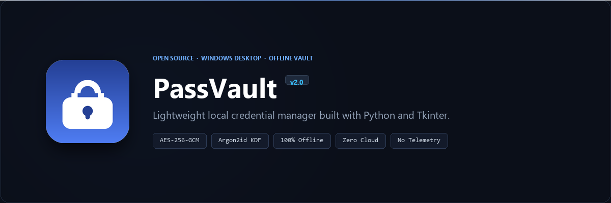

# PassVault



A lightweight, offline desktop password manager for Windows written in Python and Tkinter.

PassVault stores your credentials in a locally encrypted database using AES-256-GCM and Argon2id. It runs completely offline, with no network sockets, no background telemetry, and no account subscriptions.

[🇪🇸 Documentación en Español](README.es.md)

---

## Motivation

I built PassVault as a personal project because I wanted a simple, reliable way to manage credentials on Windows without two common trade-offs:

1. **Cloud dependency:** Many modern password managers require creating a remote account and syncing data to external servers. If you just want a personal, local database that never leaves your machine, cloud-first tools are overkill.
2. **Heavy memory footprint:** Most desktop clients today are wrapped in Electron and consume 300–600 MB of RAM just to display a list of strings. PassVault is built with native Python + Tkinter; it starts in under half a second and sits at around 25 MB of RAM.

---

## Technical Overview

- **Encryption:** AES-256 in GCM mode (Galois/Counter Mode). Every save operation generates a fresh random 96-bit nonce and produces an authentication tag. Header metadata (version, salt, iterations) is bound into the cipher via Authenticated Additional Data (AAD) to prevent tampering.
- **Key Derivation:** Argon2id via `argon2-cffi` configured with 256 MiB memory cost, 4 iterations, and 4 parallel lanes. If the CFFI library is unavailable, it falls back to Python's standard `hashlib.scrypt`.
- **Atomic Writes:** Saves are written to a temporary file first, the existing file is rotated to `.bak`, and the file is atomically replaced to prevent corruption if power is cut mid-write.
- **Password Generator:** Uses Python's `secrets` module (operating system CSPRNG). Calculates Shannon entropy in bits and estimates brute-force crack times based on effective character sets.
- **Audit Tool:** Scans the local vault for reused passwords across accounts, weak credentials (<60 bits of entropy), and empty entries.
- **Localization:** Native English and Spanish interface with automatic Windows system locale detection and manual toggle in Settings.

For detailed cryptographic specifications, file format structure, and the complete threat model, see [ARCHITECTURE.md](ARCHITECTURE.md).

---

## Honest Limitations (What PassVault is NOT)

To be clear about the project's scope:

- **No browser autofill extension:** You copy and paste credentials using keyboard shortcuts (`Ctrl+C`, `Ctrl+U`). The clipboard automatically clears after 30 seconds.
- **No multi-device sync:** PassVault has zero networking code. If you need seamless synchronization across your phone and tablet, tools like Bitwarden or 1Password are much better choices.
- **No password recovery:** Your master password is never stored. Decryption succeeds only if the GCM tag verifies. If you lose your master password, the data cannot be decrypted.

---

## Installation & Usage

### Running from source (Recommended)

Requires Python 3.10 or newer:

```bash
git clone https://github.com/pablomorenoc96/passvault.git
cd passvault
pip install -r requirements.txt
python gestor_passwords.py
```

Or double-click `Iniciar Gestor.bat` on Windows.

### Standalone Executable

If you don't have Python installed, precompiled binaries are available in the [Releases](https://github.com/pablomorenoc96/passvault/releases) tab.

---

## Data Storage

| File | Location | Description |
|:---|:---|:---|
| Primary Vault | `%APPDATA%\GestorPasswords\vault.dat` | AES-256-GCM encrypted database |
| Backup | `%APPDATA%\GestorPasswords\vault.dat.bak` | Previous version rotated on save |
| Preferences | `%APPDATA%\GestorPasswords\preferencias.json` | Theme and UI settings |

**Portable mode:** If a `vault.dat` file exists in the same folder as the script or executable (such as on a USB flash drive), PassVault will use that local database instead of `%APPDATA%`.

---

## Keyboard Shortcuts

- `Ctrl + N`: New entry
- `Ctrl + E`: Edit selected entry
- `Ctrl + C`: Copy password
- `Ctrl + U`: Copy username
- `Ctrl + F`: Search filter
- `Ctrl + G`: Password generator
- `Ctrl + L`: Lock vault immediately
- `Del`: Delete entry

---

## Testing

The test suite covers key derivation, cipher authentication, AAD tampering detection, bad password rejection, and generator logic:

```bash
pip install pytest
pytest -v
```

Automated tests run on Windows and Ubuntu on every commit via GitHub Actions.

---

## License

MIT License. See [LICENSE](LICENSE) for details.
